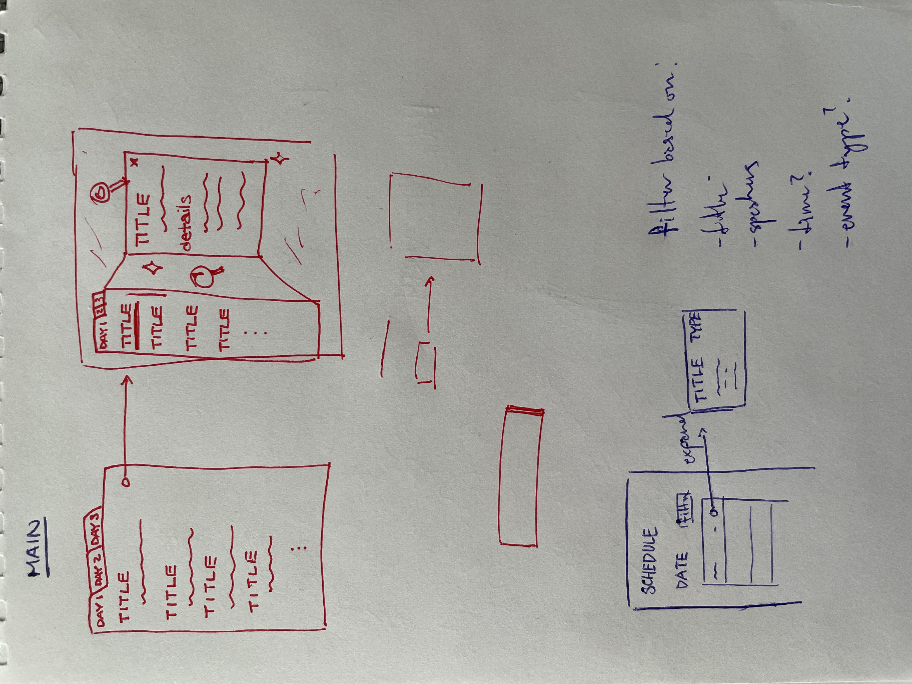
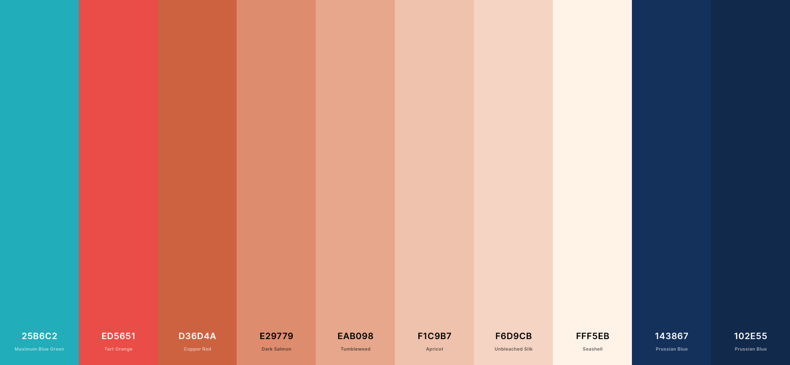

# HTN Frontend Challenge Writeup

## Part one: 
**Walk us through your development process as you worked on this project. How did you plan out the structure and design of it? How did you decide on the tools you've used? Did you encounter any problems? And if so, how did you solve them? Are there any areas of your code that you're particularly proud of or want to point out?**

My thought process when developing a new (frontend) project usually goes something like this:
1. **figure out the core features of the project**
2. **decide on what technologies to use**
3. **draw up potential basic layouts/designs**
4. **revisit features with designs and layouts in mind &rarr; adjust plans as necessary**
5. **begin development, a healthy mix of programming and testing in addition to readjusting designs**

---

1. The core features of the project were relatively simple to figure out for this project, after all, it was mostly detailed for me already in the `challenge.md` doc. 
I needed the ability to: retrieve data, conditionally display sorted data, have a verification/login process, and a way to filter/search through the data.

2. I built the app using [React](https://reactjs.org) and the component library [Styled-Components](https://styled-components.com). I chose these for a number of reasons, one of which being that I am most familiary and comfortable with React, but also because I really like the motivating idea behind React, that of reducing complex pages down into smaller components which can then be used to build off of each other. Styled Components takes this idea even further, allowing components to be rolled together with the css, eliminating the need for lengthy, difficult to read css files. This can be seen through the various components in the components folder, as well as the theme file which allow a consistent style to be applied through the site.

3. A number of ideas were drawn up and discarded and a few were continuously cycled through during the process. I have a few sketches from this stage as well as a colourscheme:  
I ended up mostly going with the design on the bottom of my sketch there. Initially, the plan was to have the each event expand out into it's own side component which would then display more details, but in the end, I decided that it probably overcomplicated things. There wasn't really enough text in the descriptions to warrant a side view like that, and it would also inhibit the user from having several events expanded at once.

4. At this stage, I have a solid idea of how I want to begin creating the app. This step is for last minute changes in case a design is totally incompatible with a planned feature. In this case, there wasn't much for this step, but I did continue to change pieces while developing.

5. Throughout development I tend to do a lot of quick iterations, loosely implementing features before returning to clean up. I find it a little easier to refactor even ugly code if all the features are there.

I ran into a few small obstacles, many due to not having worked with pure React in a while (my current job uses a Clojure wrapper for React and I didn't expect it to be that different, but there are a number of habits I've developed from working with a functional langauge these months). In particular, I find setting up layouts and performing positioning tasks to be particularly time-consuming after not using React for a while. 

I think the biggest problem that I came across during the challenge would be figuring out the best way to organize the events and manage the state. Though there aren't actually a large number of events per se, there are a lot of different ways of sorting and filtering those events. At this point I'm still not sure if the way I solved it is efficient at all. I ended up tracking a number of variables through the state. This includes the entire list of events, the list of events that are currently being shown on the page (depending on whether the user is logged in or not as well as if a search term is present), as well as a list of events that are currently expanded and showing more details on the page. All of these lists and state variables allow the app to be perfectly scalable however. Everything except the header is generated from the data retrieved and thus would require no effort to extend further.

On a more positive note, I do like the way I handled the searching/filtering of the events. It allows the searching of multiple terms at a time and filters the events depending on whether any of the search terms appear in the date, title, event type, or speakers' names. The function does look a bit unwieldly, given how long it is, but each case is split apart and I believe it's still relatively easy to understand what it does at a glance. 

As well, though some of the components could definitely be condensed further (and maybe some renamed), I think the modularization of the code makes it easier to tohers to understand and be able to extend.

## Part two:
**Given additional time, how would you extend your application to become a fully functional product that thousands of hackers and the general public would use at Hackathon Global Inc.™'s next event?**

Some additional features that I would definitely want to add would include:
- a way to download a calendar file from the site (I'm a big calendar nerd and always use this feature when sites have it available)
- a way to star or favourite events to provide yet another way to filter/sort the events
- during the event itself, I think it would also be nice to add in a section showing ongoing events, or maybe events that happen to overlap
- this wasn't included in the information, but during the event itself, since it's online, having links to the meetings on the page itself would be helpful

There are a lot of things I'd like to change about my particular app given more time. For one, the design is a little flat, especially the header area which is kind of a mish-mash of all the features I needed. For a larger audience, more time would definitely need to be taken to flesh out a more cohesive, intuitive design so to ensure that it's straightforward to navigate for everyone. Addtionally, while I did take time to ensure that the app is responsive and works across devices, I do believe the design gets much worse with the sizes of components being mismatched with their importance, and this would be another area for improvement.

In terms of just the codebase, it could still be cleaned up a lot more. In terms of the components, there are certainly still superfluous elements strewn throughout that could be ironed out. One concrete addition that I would be able to make use of would be the library [Styled-System](https://styled-system.com) which is something I've used before at work and on my own personal website. It allows more elements of the styling to be generalized and overall makes creating a large number of styled components easier to manage. 
